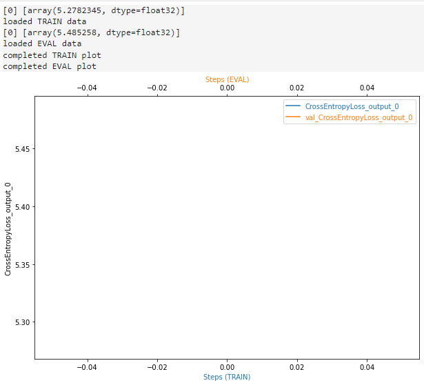

# Image Classification using AWS SageMaker

Use AWS Sagemaker to train a pre-trained model that can perform image classification using Sagemaker profiling, the debugger, hyperparameter tuning, and other ML engineering best practices. This can be done on the given dog breed classification dataset or one of your choice.

In this project we used AWS Sagemaker to perform an image classification task on the dog breeds dataset. As a base model we use Resnet50 which is a pre-trained model and brings. We will perform the hyperparameter adjustment so that the model is trained with the best set of hyperparameters within an experimented radius.

We also use profiler profiling, to optimize resources to utilize longer training resources and later available data, and use AWS at cost and cost to maximize performance during training. Along with the profiler profile, they also bring the debugger monitors, model parameters such as a loss function and capture information such as overfitting, overtraining, loss not decreasing, fading gradients, and information that helps us understand how it is the training.

After all these tasks, we deploy the model to AWS, perform inferences and analyze the model's response.

## Project Set Up and Installation
Enter AWS through the gateway in the course and open SageMaker Studio. 
Download the starter files.
Download/Make the dataset available.

### Files in the project
The Core of the project is the train_and_deploy.ipynb notebook, for training we use train_model.py inside the scripts folder, and for hyperparameter tuning we use hpo.py inside the scripts folder as well.

The Affenpinscher_00003.jpg image is to be used to test the endpoint.

## Dataset
The provided dataset is the dogbreed classification dataset which can be found in the classroom.

The Dataset we use is the dog breed dataset, it contains 133 dog categories and a total of 8351 images, divided into training, validation and testing where:

- 6680 Images are in the training set
- 835 Images are in the validation set
- 836 Images are in the test set

### Access
Upload the data to an S3 bucket through the AWS Gateway so that SageMaker has access to the data. 

## Hyperparameter Tuning

For this experiment, we used Resnet18, as it is a lighter and faster model to train.

The parameters we tuned were the learning rate, batchsize and epoch, in the following radii:
- Learning Rate: (0.001, 0.1)
- Batch size: (32,64,128)
- Epochs: (2,4)

## Debugging and Profiling

To perform debugging and profiling using sagemaker, we need to define the rules in the notebook, after that we put in the training script what we want to record, after that, we will have the registered metrics and we can analyze both training parameters, through the debugger, as well as AWS resources were used, and thus choose to use the resources, reducing cost and increasing performance.

### Results

Using the debugger we were able to see how the model performs during each epoch and identify problems such as PoorWeightInitialization, while profiling brought us other information about how we can improve the uses of our resources on AWS.

We conclude that both the Debugger and the Profiler are very useful tools to follow the life cycle of a model as they give us greater visibility of what happens during and after training.

More informations about the Profiler is in the ProfillerReport folder

## Model Deployment

We deploy the model using the ml.m4.xlarge instance, the notebook shows the code how to make predictions, the image is already in the local folder so just run the cells.

